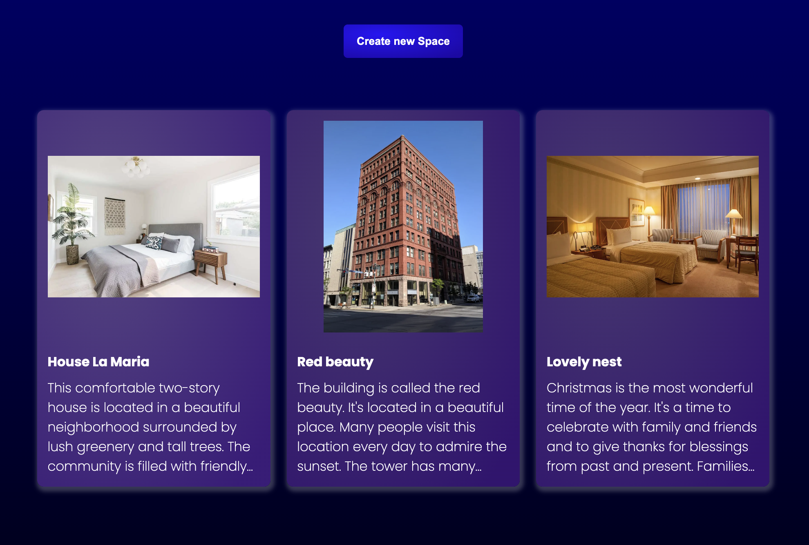
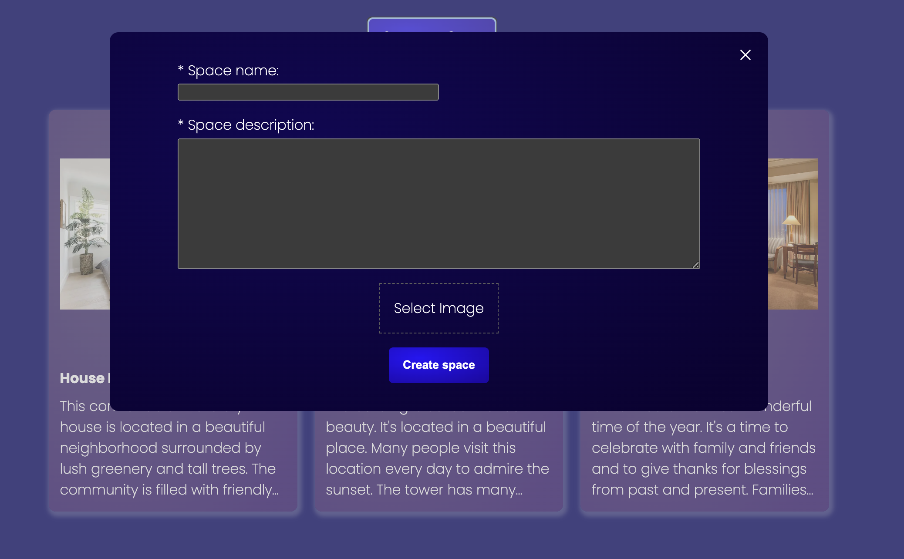
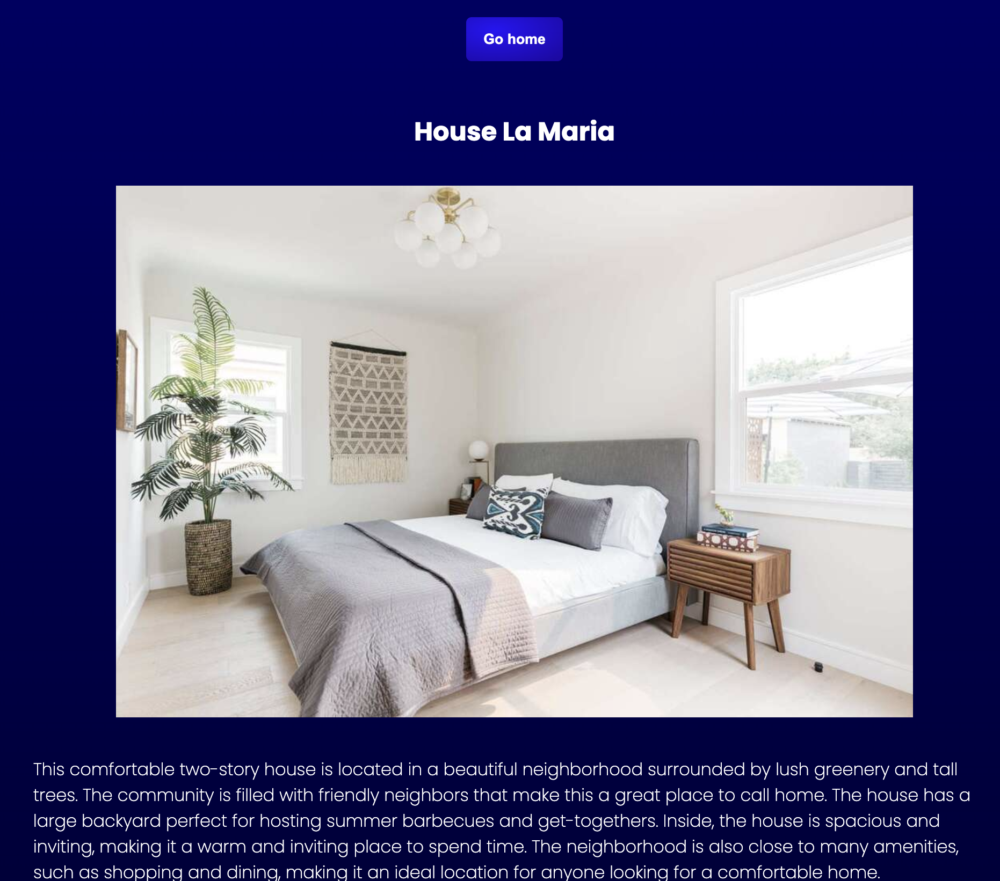
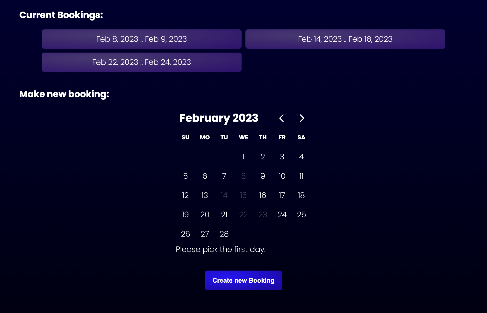
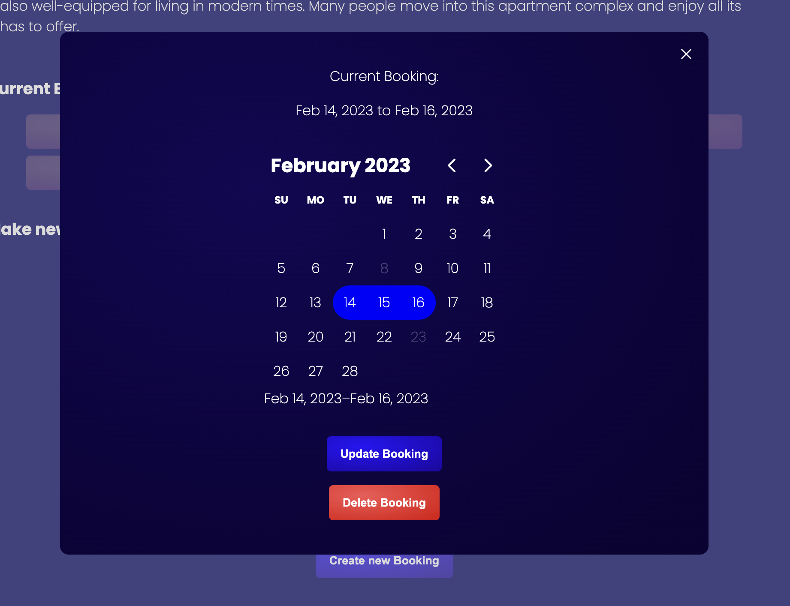

# Bookings experience

This is a project built in NextJs. It simulates the experience of both creating simple places to book, and booking this places.

## Video (open it in youtube)

## features

- Show place availability.
- Avoid booking overlapping.
- Save all info into redux.
- Theme changes automatically according to user machine's preferences

## images

